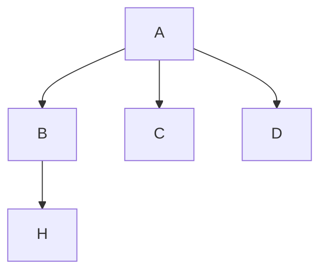

[Назад](../README.md)
***
## **Правила форматирования:**
### Общие
#### 1. Вопросы(или их группы) должны отделяться друг от друга разделителями ``***`` или ``---``. 
```md
#### Вопрос 1
+ Ответ
***
#### Вопрос 2
- [ ] Ответ 1
- [x] **Ответ 2**
```
#### 2. Если существуют типовые задания с немного отличным условием – выделяйте различные части через \`\`часть\`\`.
```md
**Результат сложения двух двоичных чисел со знаком `1011010011100000` + `1011010100110111`:**  
- [ ] правильный  
- [x] **неправильный**  
```
#### 3. Если есть желание сгруппировать задания в группы с названием, выделяйте группы с помощью \#\#
```md
## Группа 1
#### Текст задания
1) Ответ 1
2) Ответ 2
3) Ответ 3 и т.д.
***
```
#### 4. Если правильные ответы неизвестны, указываются все возможные варианты ответа и оформляются в формате 3
```md
#### Текст задания
+ Ответ 1
+ Ответ 2
+ Ответ 3 и т.д.
```
#### 5. Обязательно проверяйте правильность форматирования в предпросмотре
###Оформление разных типов заданий
#### 1. Задания на последовательность ответов
```md
#### Текст задания
1) Ответ 1
2) Ответ 2
3) Ответ 3 и т.д.
```
#### 2. Задания с (известными) вариантами ответов
```md
#### Текст задания
- [x] **Ответ 1(правильный)**
- [ ] Ответ 2
- [ ] Ответ 3 и т.д.
```
#### 3. Задания без (известных) вариантов ответа
```md
#### Текст задания
+ **Ответ 1**
+ **Ответ 2**
```
#### 4. Задания с картинкой
```md

#### Вопрос 1
+ Ответ 1
#### Вопрос 2
+ Ответ 2
```
Ответы в любом из форматов выше
Если картинка подходит на несколько заданий – задания группируются
#### 5. Задания со справкой
```md
\```
Используемые сокращения:
  СК - регистр счетчик команд процессора,
  РК - регистр команд процессора,
  РС - регистр состояния процессора,
  УУП - устройство управления процессора,
  АЛУ - арифметико-логическое устройство,
  ОЗУ - оперативное запоминающее устройство,
  РАП - регистр адреса памяти ОЗУ,
  РДП - регистр данных памяти ОЗУ
\```
#### Вопрос 1
+ Ответ 1
#### Вопрос 2
+ Ответ 2
Косую черту убрать!
```
Если справка верна для нескольких вопросов – вопросы группируются
#### 6. Задания со схемой
Вообще для этого есть целая [статья на Хабре](https://habr.com/ru/articles/652867/), советую ознакомиться
```md
```mermaid
graph TD;
  A-->B;
  A-->C;
  A-->D;
  B-->H;
\```
Косую черту убрать!
```
Получится что-то вроде такого

#### 7. Задания с таблицей
```md
|Вход|Вход|Вход|Выход|
|:-|:-|:-|:-|
|0|0|1|1|
|0|1|1|1|
|0|0|0|0|
|1|0|1|1|
|0|1|0|1|
|1|1|1|1|
|1|1|0|1|
|1|0|0|1|
```
Текст задания может быть, а может и отсутствовать.
Если кол-во колонок в шапке ≠ кол-ву колонок ниже – допускается(интуитивно-понятное) изменение структуры таблицы
Не засоряйте репозиторий лишними картинками!!!
Получится что-то вроде такого
|Вход|Вход|Вход|Выход|
|:-|:-|:-|:-|
|0|0|1|1|
|0|1|1|1|
|0|0|0|0|
|1|0|1|1|
|0|1|0|1|
|1|1|1|1|
|1|1|0|1|
|1|0|0|1|

