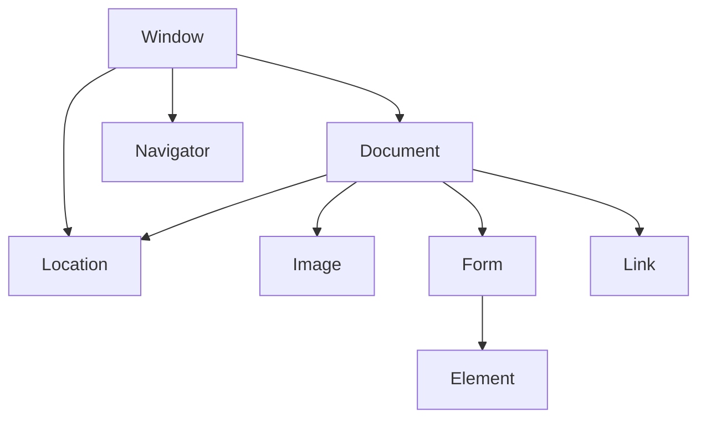

[назад](web.md)
***

***
#### Выберите верные утверждения, относящиеся к ASP:
- [ ] ASP получает доступ к интерфейсу программирования приложений Internet Information Server с помощью языка сценариев Perl
- [ ] Обработка запросов веб-клиента с URL, содержащим расширение *.asp, выполняется специальным исполняемым *.EXE модулем
- [x] **ASP получает доступ к интерфейсу программирования приложений Internet Information Server с помощью языка сценариев JScript**
- [ ] Обработка запросов веб-клиента с URL, содержащим расширение *.asp выполняется непосредственно веб-сервером
- [x] **ASP получает доступ к интерфейсу программирования приложений Internet Information Server с помощью языка сценариев VBScript**
- [x] **Обработка запросов веб-клиента с URL, содержащим расширение   \*.asp выполняется через ASP.DLL**
***
#### Выберите верные утверждения, относящиеся к ISAPI:
- [x] ISAPI-расширения работают намного быстрее чем обычные программы CGI
- [x] ISAPI-расширения - это API для веб-сервера IIS
- [ ] ISAPI-расширения работают медленнее чем обычные программы CGI
- [x] ISAPI-приложения загружаются в пространство процесса IIS
- [x] Приложения ISAPI представляют собой библиотеки DLL, напрямую взаимодействующие с IIS API
- [ ] ISAPI-приложения загружаются в пространстве изолированном от пространства процесса IIS
***
#### Предопределенные переменные в языке Perl
| **Переменная** | **Соответствие**                                                             |
|----------------|-----------------------------------------------------------------------------|
| `$$`           | Идентификатор текущего процесса                                             |
| `$0`           | Имя файла, в котором содержится выполняемая программа                      |
| `$.`           | Номер строки, прочитанной из файла последней                               |
| `$]`           | Номер версии Perl                                                           |
| `$1..$9`       | Фрагменты текста, отмеченные при выполнении операции сопоставления с шаблоном |
| `$!`           | Сообщение об ошибке                                                         |
| `$^T`          | Время в секундах с начала 1970 года до запуска данной программы             |
***
#### Постройте регулярное выражение, описывающее номер телефона, например _+7 933 450 1234_
/^(\+7|8)([0-9]{10})$/
***
#### Кто является инициатором записи данных Cookie?
+ Веб-сервер
***
#### Выберите правильное соответствие
| **Оператор** | **Соответствие**           |
|--------------|----------------------------|
| `m//`        | оператор поиска            |
| `s///`       | оператор замены            |
| `tr///`      | оператор посимвольной замены |
| `~=`         | оператор присоединения     |
| `<>`         | бриллиантовый оператор     |
***
#### Выберите правильное соответствие
| **Передача данных**                                                                                               | **Метод соответствия** |
|---------------------------------------------------------                                                          |-----------|
| Данные с веб-страницы клиента передаются в теле запроса клиента                                                   | POST      |
| Данные с веб-страницы клиента передаются в строке состояния запроса клиента                                       | GET       |
| Клиентские данные от веб-сервера к интерпретатору CGI-сценария передаются через переменную окружения QUERY_STRING | GET       |
| Клиентские данные от веб-сервера к интерпретатору CGI-сценария передаются через входной поток чтения т            | POST      |
***
#### Выберите правильную последовательность действий
1) Веб-сервер получает запрос от веб-клиента
2) Веб-сервер отправляет ответ веб-клиенту, включив в него поле Set-cookie
3) Веб-клиент получает ответ от веб-сервера и сохраняет данные Cookie локально на своём жёстком диске
4) Веб-клиент отправляет запрос на веб-сервер, включив в него поле Cookie
***
#### К какому классу языков относятся языки сценариев с точки зрения поддержки типизации переменных?
+ К нетипизированным языкам
***
#### Для языка регулярных выражений выберите правильное соответствие
| **Символ** | **Соответствие**                 |
|------------|----------------------------------|
| `*`        | ноль или более повторов          |
| `^`        | начало строки                    |
| `$`        | конец строки                     |
| `\B`       | не граница слова                 |
| `{m,}`     | не менее m повторов              |
| `+`        | один или более повторов          |
| `?`        | ноль или один повтор             |
| `\b`       | граница слова                    |
| `{m,n}`    | от m до n повторов включительно  |
| `{n}`      | ровно n повторов                 |
| `{,n}`     | не более n повторов              |
***
#### Для языка регулярных выражений выберите правильное соответствие
| **Символ**     | **Соответствие**                                      |
|----------------|--------------------------------------------------|
| `\w`           | любой буквенно-цифровой символ, включая подчёркивание |
| `\W`           | любой символ (кроме букв, цифр и подчёркивания)   |
| `\s`           | любой неотображаемый символ (пробел, таб, перенос) |
| `\S`           | любой символ, кроме неотображаемых               |
| `\d`           | любая цифра (эквивалент [0-9])                   |
| `\D`           | любой нецифровой символ                          |
| `[xyz]`        | любой символ из указанного множества             |
| `[^xyz]`       | любой символ, не входящий в указанное множество  |
***
#### Для языка регулярных выражений выберите правильное соответствие
| **Оператор** | **Соответствие**                          |
|--------------|---------------------------------------|
| `$`          | оператор задания позиции шаблона в строке |
| `\b`         | оператор задания позиции шаблона в строке |
| `[xyz]`      | оператор описания набора символов     |
| `[^xyz]`     | оператор описания набора символов     |
| `\d`         | оператор описания набора символов     |
| `\w`         | оператор описания набора символов     |
| `?`          | оператор-квантификатор                |
| `*`          | оператор-квантификатор                |
| `{m,}`       | оператор-квантификатор                |
***
#### Скалярные и ассоциативные массивы в Perl. Выберите соответствие
| **Описание**                                                         | **Соответствие** |
|--------------                                                         |-------------|
| перед именем переменной - ассоциативного массива записыватся знак          | % |
| обращение к элементу ассоциативного массива реализуется через указание | строки-ключа |
| перед именем переменной - скалярного массива записывается знак             | @ |
| обращение к элементу скалярного массива реализуется через указание | числового индекса |
***
#### Постройте регулярное выражение, описывающее MAC адрес, например 00:AB:CD:EF:11:22
^([0-9A-Fa-f]{2}[:\-]?\s?){5}[0-9A-Fa-f]{2}$

